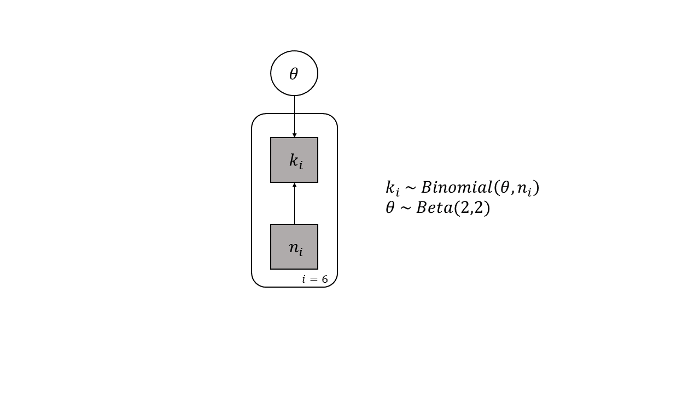
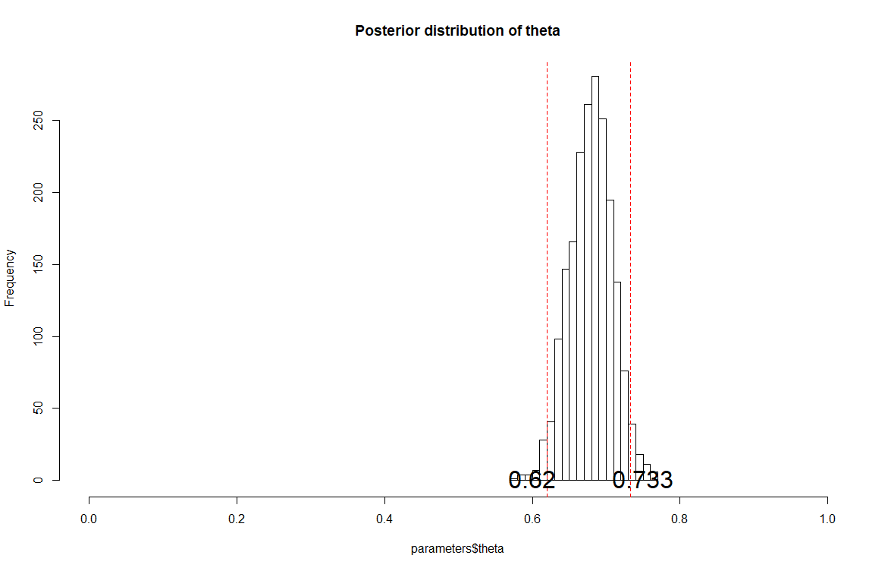
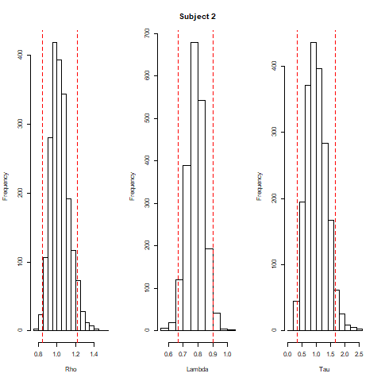
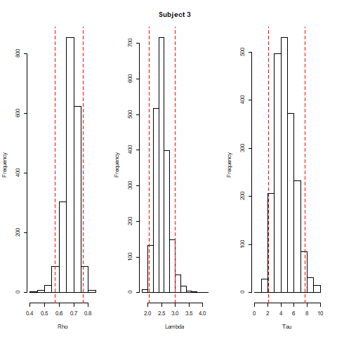
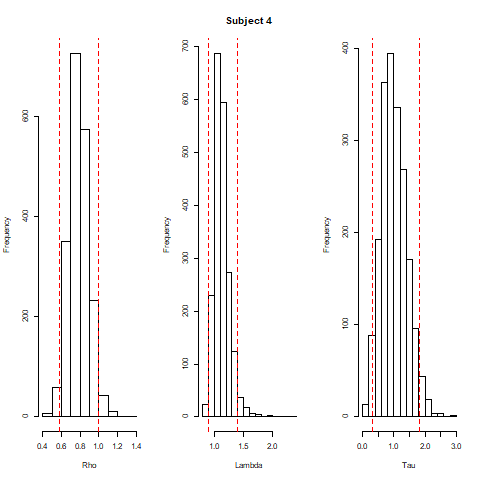
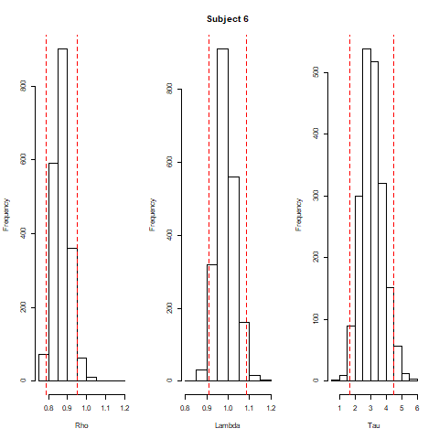
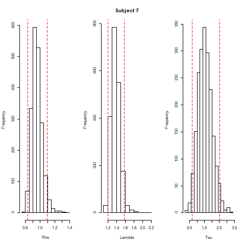
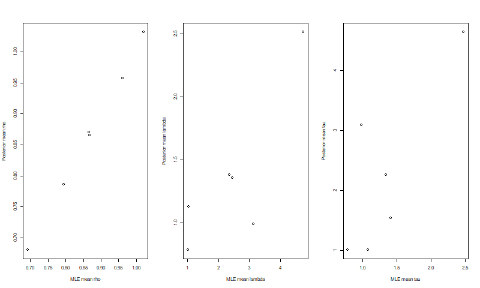

```{r setup, include=FALSE}
knitr::opts_chunk$set(echo = TRUE)
```

## Question 1
### 1.1


### 1.2



## Question 2
### 2.1






### 2.2
```{r echo=FALSE}
load("posterior mean.RData")
library(knitr)
kable(par_mean)
```


### 2.3



